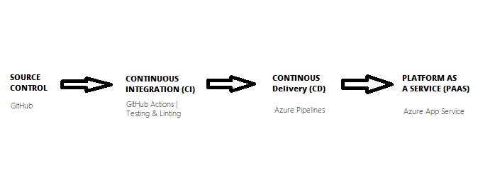

[](https://github.com/paulnoc/PaulNO-ML-api-CICD/actions/workflows/main.yml)


# Overview

This project is a complete solution of a python-based Machine Learning model that predicts the prices of houses in Boston. The application was built to run using Azure App Services on Microsoft Azure Platform as a Service (PaaS).

The source control management system adopted is GitHub and GitHub Actions as build server for Continuous Integration (CI). Latest changes were recorded by enabling Continuous Delivery (CD) using Azure pipelines.


# Project Plan

Agile methodologies were employed in managing the project. Details of the project phases and planning can be found in the links below:

* A [link](https://trello.com/b/qflJcQWC/ci-cd-for-ml-app) to a Trello board for monitoring the project.
* A [link](./pno-project-plan.xlsx) to a spreadsheet that captures the project plan


# Instructions



In order to recreate the CICD pipeline, follow the steps detailed below.

* Clone the repository into Azure Cloud Shell and change directory


* Create and activate a virtual environment using the Make command (`make setup`)
```
make setup
```


* Install dependencies using the Make command (`make install`)
```
make install
```


* Lint code and run unit test using the Make command (`make lint`, `make test`)
```
make lint
```
```
make test
```


NOTE: The `make all` command executes all the commands above

* Run the app (locally) and test by making an API call from a new terminal
```
python app.py
```


```
sh ./make_prediction.sh
```


* Deploy the app as an Azure WebApp and make requests to the API
```
az webapp up --name <app_name> --resource-group <resource_group_name> --runtime "PYTHON:3.7"
```


ONow make an API request using the command
NOTE: Change the url in the file 'make_predict_azure_app.sh'
```
sh ./make_predict_azure_app.sh
``` 


Logs from the running application can be viewed here
```
https://<app-name>.scm.azurewebsites.net/api/logs/docker
```


Configure Azure pipelines following the documented steps:
[Refer to the official documentation as you setup CI/CD](https://docs.microsoft.com/en-us/azure/devops/pipelines/ecosystems/python-webapp?view=azure-devops)

* Create a Devops Project


* Create a Service Connection


* Create a Agent Pool


* Create Azure Pipeline


* Run Pipeline


* Load test using Locust


# Demo 

https://www.youtube.com/watch?v=hGzCNbvsjpw


# Alternative deployment

Kubernetes can be used to deploy this app (containerized as a Docker app). This approach would provide a resilient environment and smoothen the deployment process.


